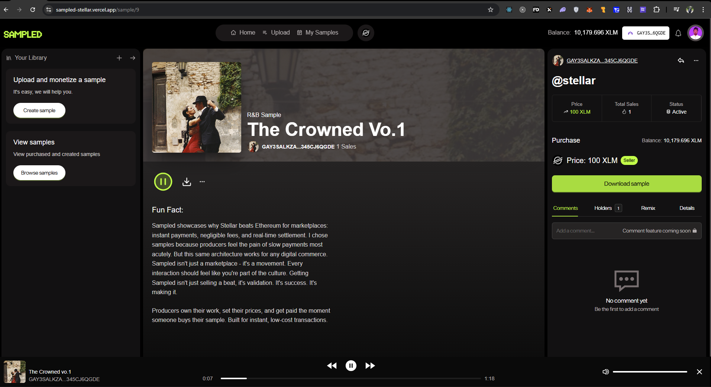

# SAMPLED

**Sampled** - The Decentralized Sample Marketplace on Movement M1



Sampled is a decentralized music sample marketplace built on Movement M1, leveraging the Move programming language for secure, efficient smart contracts. Producers can sell their samples with instant payments and minimal fees.

## Features

- **Instant Payments**: Fast transaction finality with Movement M1
- **90/10 Revenue Split**: Only 10% platform fee vs. industry standard 30-50%
- **Smart Contract Automation**: No intermediaries, automated licensing and payments
- **IPFS Storage**: Decentralized file storage for audio samples
- **Commercial Licensing**: Automatic license generation with each purchase

## Tech Stack

- **Blockchain**: Movement M1 (Move smart contracts)
- **Frontend**: React 19, TypeScript, Vite
- **Styling**: Tailwind CSS, Ant Design
- **Storage**: IPFS (Pinata)
- **State Management**: React Query

## Getting Started

### Prerequisites

- [Node.js](https://nodejs.org/) (v22 or higher)
- [npm](https://www.npmjs.com/)

### Installation

1. Clone the repository:

```bash
git clone <repository-url>
cd sampled-movement
```

2. Install dependencies:

```bash
npm install
```

3. Set up environment variables:

```bash
cp .env.example .env
```

Edit `.env` with your configuration.

4. Start the development server:

```bash
npm run dev
```

## Project Structure

```
sampled-movement/
├── src/
│   ├── components/       # React components
│   ├── hooks/           # Custom React hooks (wallet, contracts)
│   ├── pages/           # Application pages
│   ├── providers/       # Context providers
│   ├── util/            # Utility functions
│   └── main.tsx        # Application entry point
├── public/             # Static assets
└── package.json        # Dependencies
```

## Smart Contract Integration

Smart contracts will be written in Move for Movement M1. The hooks in `src/hooks/` are structured to easily integrate with Movement contract calls once they're deployed.

### Contract Hooks (To be implemented)

- `useWallet()` - Wallet connection and management
- `useSampledContract()` - Contract interaction hooks:
  - Upload samples
  - Purchase samples
  - Withdraw earnings
  - Query samples and stats

## Contributing

Contributions are welcome! Please feel free to submit a Pull Request.

## License

[Add your license here]

## Status

Currently in development - migrating to Movement M1 blockchain.
